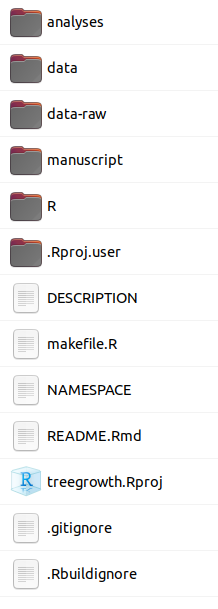

## `template` package

### Generic template for data analysis projects structured as R packages


[](http://hits.dwyl.com/Pakillo/template)


The `template` package automates creation of new projects with all the necessary scaffolding: different folders for data, scripts, and functions, plus (optionally) additional files required for an R package structure. It can simultaneously create and synchronise a new repository on GitHub so one can start working immediately.

`template` can create both projects with or without R package structure. Structuring data analysis projects as R packages (a.k.a. "research compendia") can bring some advantages (e.g. see [this blogpost](http://rmflight.github.io/post/analyses-as-packages/), [this repo](https://github.com/ropensci/rrrpkg), [these](https://inundata.org/talks/rstd19/#/) and [these slides](https://doi.org/10.6084/m9.figshare.12479984.v1) or read [Marwick et al.](https://doi.org/10.7287/peerj.preprints.3192v2)). But there are also [good reasons](https://milesmcbain.xyz/posts/an-okay-idea/) why an R package structure may not always be needed or convenient. 


### Installation

```{r eval=FALSE}
# install.packages("remotes")
remotes::install_github("Pakillo/template")
```


### Usage

First, load the package:

```{r eval=FALSE}
library("template")
```

Now run the function `new_project` to create a directory with all the scaffolding (slightly modified from R package structure). For example, to start a new project about tree growth, just use:

```{r eval=FALSE}
new_project("treegrowth")
```

This will create a new Rstudio project with this structure:

```{r echo=FALSE}

```

You can create a GitHub repository for the project at the same time:

```{r eval=FALSE}
new_project("treegrowth", github = TRUE, private.repo = FALSE)
```

You could choose either public or private repository. Note that to create a GitHub repo you will need to have configured your system as explained in https://usethis.r-lib.org/articles/articles/usethis-setup.html.

There are other options you could choose, like setting up `testthat` or continuous integration (Travis-CI, GitHub Actions...). Or skip R package structure altogether. See `?new_project` for all options.


### Developing the project

1. Now edit `README.Rmd` and the `DESCRIPTION` file with some basic information about your project: title, brief description, licence, package dependencies, etc. 

2. Place original (raw) data in `data-raw` folder. Save all R scripts (or Rmarkdown documents) used for data preparation in the same folder.

3. Save final (clean, tidy) datasets in the `data` folder. You may write [documentation](http://r-pkgs.had.co.nz/data.html#documenting-data) for these data. 

4. R scripts or Rmarkdown documents used for data analyses may be placed at the `analyses` folder. The final manuscript/report may be placed at the `manuscript` folder. You could use one of the many Rmarkdown templates available out there (e.g. [rticles](https://github.com/rstudio/rticles), [rrtools](https://github.com/benmarwick/rrtools) or [rmdTemplates](https://github.com/Pakillo/rmdTemplates)). 

5. If you write custom functions, place them in the `R` folder. [Document](http://r-pkgs.had.co.nz/man.html) all your functions with `Roxygen`. [Write tests](http://r-pkgs.had.co.nz/tests.html) for your functions and place them in the `tests` folder.

6. If your analysis uses functions from other CRAN packages, include these as dependencies (`Imports`) in the `DESCRIPTION` file (e.g. using `usethis::use_package()` or `rrtools::add_dependencies_to_description()`. Also, use `Roxygen` `@import` or `@importFrom` in your function definitions, or alternatively `package::function()`, to import these dependencies in the namespace.

7. I recommend using an advanced tool like [`targets`](https://github.com/wlandau/targets) to manage your project workflow. A simpler alternative might be writing a `makefile` or master script to organise and execute all parts of the analysis. A template makefile is included with this package (use `makefile = TRUE` when calling `new_project`). 

8. Render Rmarkdown reports using `rmarkdown::render`, and use Rstudio `Build` menu to create/update documentation, run tests, build package, etc.

9. Record the exact dependencies of your project. One option is simply running `sessionInfo()` but many more sophisticated alternatives exist. For example, `automagic::make_deps_file()` or `renv::snapshot()` will create a file recording the exact versions of all packages used, which can be used to recreate such environment in the future or in another computer. If you want to use Docker, you could use e.g. `containerit::dockerfile()` or `rrtools::use_dockerfile()`.

10. Archive your repository (e.g. in Zenodo), get a DOI, and include citation information in your README.


### Thanks to:

* Carl Boettiger and his [template package](https://github.com/cboettig/template)
* Jeff Hollister and his [manuscriptPackage](https://github.com/jhollist/manuscriptPackage)
* Robert Flight: http://rmflight.github.io/posts/2014/07/analyses_as_packages.html
* Hadley Wickham: http://r-pkgs.had.co.nz/
* Yihui Xie: http://yihui.name/knitr/
* Rstudio


### Links

* https://github.com/ropensci/rrrpkg
* https://github.com/Reproducible-Science-Curriculum/rr-init
* http://ropensci.github.io/reproducibility-guide/
* https://github.com/jdblischak/r-project-workflows
* https://github.com/benmarwick/rrtools

