```{r knitr_setup, include=FALSE, cache=FALSE}

library(knitr)

### Chunk options ###

## Text results
opts_chunk$set(echo = FALSE, warning = FALSE, message = FALSE, eval = TRUE, size = 'footnotesize')

## Code decoration
opts_chunk$set(tidy = FALSE, comment = NA, highlight = TRUE, prompt = FALSE, crop = TRUE)

# ## Cache
# opts_chunk$set(cache = TRUE, cache.path = "knitr_output/cache/")

# ## Plots
# opts_chunk$set(fig.path = "knitr_output/figures/")
opts_chunk$set(fig.align = 'center', out.width = '4in', out.height = '3in', dpi = 300)

### Hooks ###
## Crop plot margins
knit_hooks$set(crop = hook_pdfcrop)

## Reduce font size
## use smallfont = TRUE as chunk option to reduce font size
# see http://stackoverflow.com/a/39961605
knit_hooks$set(smallfont = function(before, options, envir) {
  if (before) return(paste0("\n \\", options$size, "\n\n"))
  else return("\n\n \\normalsize \n")
  })

```


-----

```{r out.height='3in', out.width='4in'}

```


## Good & consistent project organisation

Facilitates

- Reproducibility
  
- Understanding by reviewers and collaborators (including yourself in a few months)
  
- Tool building and sharing
  
  
## Rules for good project organisation


> - All files in same directory

> - Raw data kept in separate folder

> - Clean data derived through scripts

> - Functions independent from analysis scripts

> - Functions well documented & tested

> - Output disposable & separate from code

> - Makefile runs analyses in appropriate order

> - README file with overall project description

> - Software dependencies under control


\scriptsize

[Noble 2009](https://doi.org/10.1371/journal.pcbi.1000424), [Rodriguez-Sanchez et al 2016](https://www.revistaecosistemas.net/index.php/ecosistemas/article/view/1178), [Wilson et al 2017]( https://doi.org/10.1371/journal.pcbi.1005510) 

\normalsize


## R package structure

\footnotesize


```
- data-raw/    # Original raw data     

- data/        # Clean data (produced w/ script)  

- R/           # Functions

- man/         # Function documentation (w/ Roxygen)

- tests/       # Tests (functions, Rmd)

- vignettes/   # Analyses, manuscript, reports (Rmd) 

- makefile     # Master script that executes everything 

- DESCRIPTION  # Metadata and dependencies

- README       # General info about the project   
```

\normalsize

----

R packages can serve as **research compendia** (including code, data and outputs) for reproducible data analysis projects


## An example

https://github.com/Pakillo/Carex.bipolar

```{r out.height='1in', out.width='4.5in'}
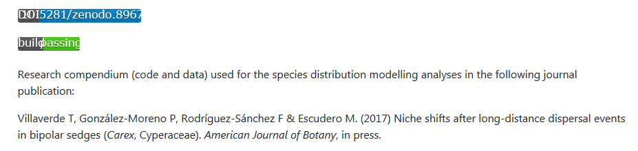
```


## Raw data and munging scripts in `data-raw` folder

```{r out.height='2in', out.width='2in'}
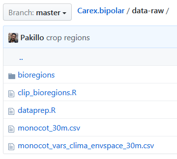
```


## Clean data go to `data` folder

```{r out.height='2in', out.width='2in'}
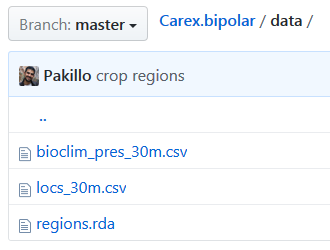
```

## Rmarkdown documents in `analysis` or `vignettes` folder 

```{r out.height='2in', out.width='2in'}
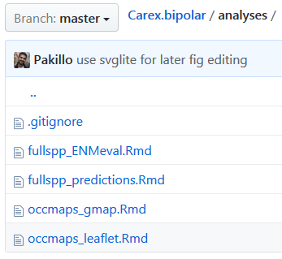
```


## Functions documented with Roxygen in `R` folder

```{r out.height='3in', out.width='3in'}
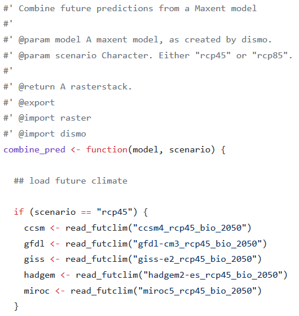
```


## Function documentation created automatically (`man` folder) 

```{r out.height='3in', out.width='4in'}
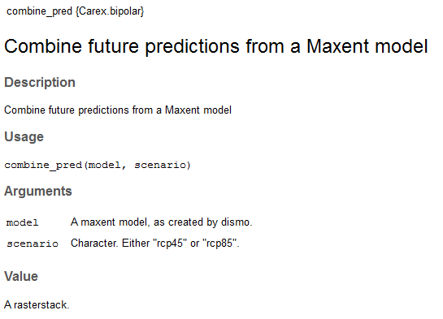
```


## Makefile runs analyses in right order

```{r out.height='2in', out.width='4in'}
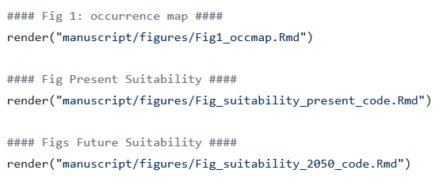
```


# Advantages 


## Advantages of R package structure

> - Reproducibility

> - Consistent, standard, streamlined organisation

> - Promotes modular, well-documented and tested code

> - Easy to share (zip, GitHub repo)

> - Easy to install & run (Dependencies)

> - Use R package development machinery:

>   - R CMD CHECK
  
>   - Continuous integration (Travis-CI)
  


## Automatic checks with every commit

```{r out.height='3in', out.width='4in'}
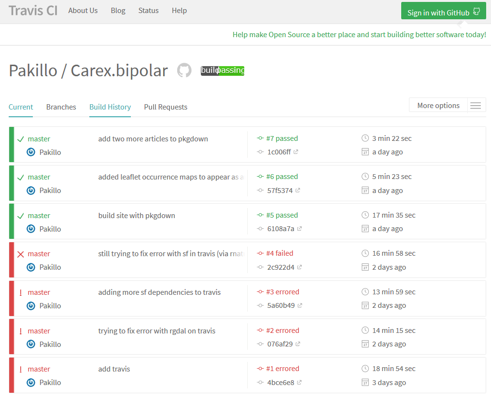
```


## Advantages of R package structure

- Reproducibility

- Consistent, standard, streamlined organisation

- Promotes modular, well-documented and tested code

- Easy to share (zip, GitHub repo)

- Easy to install & run (dependencies)

- Use R package development machinery:

  - R CMD CHECK
  
  - Continuous integration (Travis-CI)
  
> - Automatic code review with [goodpractice](https://github.com/MangoTheCat/goodpractice)
  
> - Easily create project websites with [pkgdown](https://github.com/hadley/pkgdown)


## Project websites with pkgdown

https://pakillo.github.io/Carex.bipolar/

```{r out.height='2in', out.width='4in'}
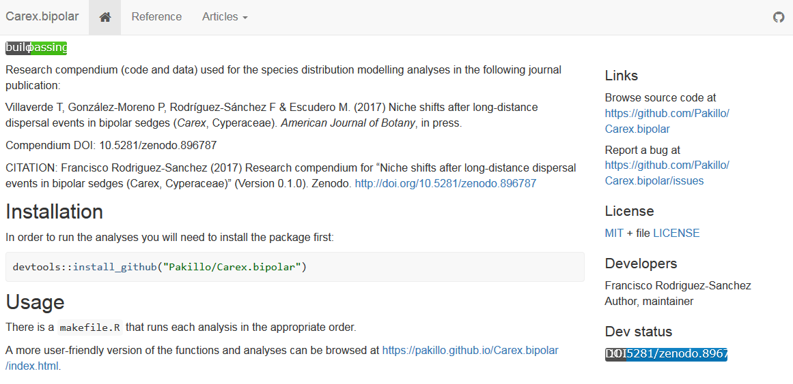
```


## All functions explained, browsable

```{r out.height='3in', out.width='4in'}
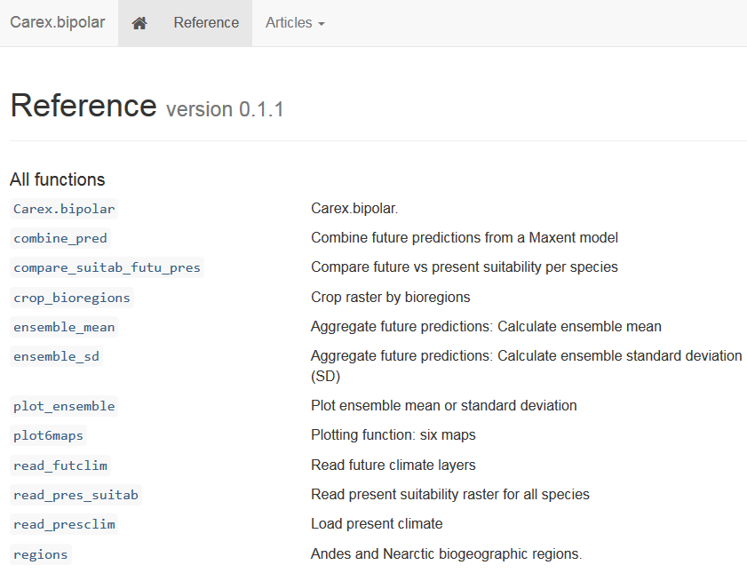
```


## Rendered analysis reports

```{r out.height='4in', out.width='3in'}
include_graphics("images/pkgdown_articles.PNG")
```


# How 

## Several tools to create projects as packages

- [rrtools](https://github.com/benmarwick/rrtools)

- [workflowr](https://jdblischak.github.io/workflowr/index.html)

- [C. Boettiger's template](https://github.com/cboettig/template)

- [my template](https://github.com/Pakillo/template)

- [manuscriptPackage](https://github.com/jhollist/manuscriptPackage)

- [pRojects](https://github.com/lockedata/pRojects)

- [Rstudio Project Templates](https://rstudio.github.io/rstudio-extensions/rstudio_project_templates.html)

- devtools, mason, prodigenr, etc


## As easy as...


\begincols
\begincol

```
library(template)

new_project("treegrowth", github = TRUE, 
  private.repo = FALSE, travis = TRUE)
```

\endcol
\begincol

```{r out.height='2in', out.width='1in', fig.align='right'}
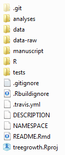
```

\endcol
\endcols


## Archive and be cited

Archive in permanent repository (Zenodo, Figshare), 

get DOI and be cited


## To read more

\scriptsize

- Marwick B, Boettiger C, Mullen L. (2017) Packaging data analytical work reproducibly using R (and friends) *PeerJ Preprints* 5:e3192v1 https://doi.org/10.7287/peerj.preprints.3192v1

- Use of an R package to facilitate reproducible research https://github.com/ropensci/rrrpkg

- Rodríguez-Sánchez F, Pérez-Luque AJ, Bartomeus I, Varela S. (2016) Reproducible science: what, why, how. *Ecosistemas* 25(2): 83-92. https://doi.org/10.7818/ECOS.2016.25-2.11

\normalsize


## End


Slides and materials available at https://github.com/Pakillo/template

```{r out.height='0.5in', out.width='1in', fig.align='center'}
include_graphics("images/CC-BY-NC-SA_logo.png")
```


